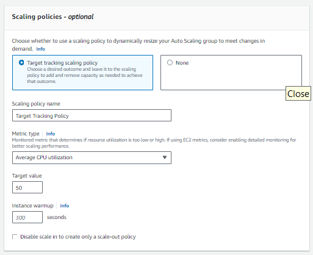

### Auto Scaling Groups

1. Navigate to **Auto Scaling Groups**
2. Set appropriate name `tech254-wafa-app-first-lt`. Shown below

3. Select Launch Template with your name
4. Scroll down and select next
5. **Choose instance options** page. Select availability zones `eu-west-1a`, `eu-west-1b`, `eu-west-1c`
NOTE: Should be the default options as shown below. 

6. press **Next**
7. **Load Balancing** > **Attach to New Load Balancer**
8. Select **Application Load Balancer** 
9. Edit the name to `tech254-wafa-app-first-lt-lb`
10. Select **Internet-facing**
11. Under default routing > **Create new target group**
12. Edit name to `tech254-wafa-asg-app-first-It-lb-tg`
NOTE: The name must be within 32 characters and no underscores. Settings should look like below image

13. Scroll down to **Health Checks**. Tick box for 'Turn on Elastic Load Balancing Health checks'. 
NOTE: This will be the recommended option

14. Group Size:
    15. Desired capacity: 2
    16. Minimum capacity: 2
    17. Maximum capacity: 3

18. Scaling policies > `Target Tracking Scaling Policy` and copy settings below

19. **Add Notifications** > skip this and press **Next**
20. **Add Tags** = Name
21. **Value** = `tech254-wafa-first-asg-HA-SC`
22. Press Next
23. Check through the settings and click **Create Auto Scaling Group**

