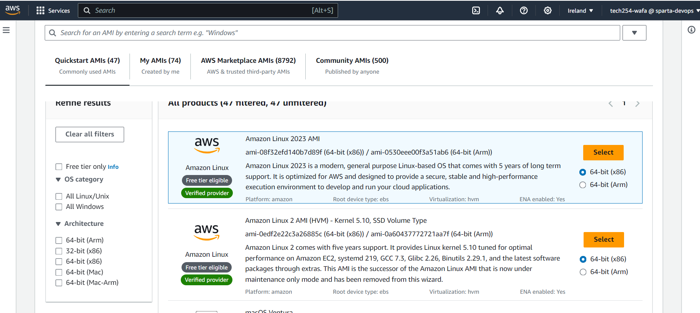

## Creating Instances 

1. Download the `tech254.prem` file 
2. Move the `tech254.prem` into the ssh folder. IMPORTANT.
3. If the file is hidden, select view > Hidden Files

4. Log into AWS using link and credentials provided
5. It should be directed to the homepage as shown below. Ensure the server is set to **IRELAND**

6. Search for **EC2** on search bar and click into it. Following page should appear

7. Click **Launch Instances** (in the orange button)

8. On the 'Launch an Instance' page, Under the ''Name and Tags' section, type `tech254_wafa_nginx`

9. Scroll to next section, **'Application and OS Images (Amazon Machine Image'** and select `Browse more AMIs`
Following webpage should appear.

10. Click on Community AMIs on the tabs at the top

11. Search for `18.04 lts 1e9`. Select the **Ubuntu verified server**.

12.  It should take you back to the instances setup page. Retype the name if it disappeared

13. Scroll to 'Instance Type' section. It should, by default, be on `t2.micro` setting

14. Scroll to the next section 'Key Pair' and select **tech254** option in the dropdown list
15. Scroll to 'Network Settings'. Click **Edit**
16. Set the **Security group name** as `tech254_wafa_basesg`
17. Copy and paste this into the description
18. Scroll down to **Inbound security group rules**
19. By default, SSH will already be added. Add **HTTP** and **HTTPS** as shown below. They should all be set to **Anywhere**

21. Configure Storage should be set to default **8 GiB**
    
22. Read over the summary to match the following details and click **Launch Instance**

24. Click on **Connect** on top right 
23. Open GitBash Terminal 
23. type `cd .ssh` to go into the file
24. copy and paste the command `chmod 400 tech254.pem`
25. Copy and paste `ssh -i "tech254.pem" ubuntu@ec2-34-244-108-192.eu-west-1.compute.amazonaws.com` to the terminal 
26. Type `yes` if you are asked to continue 
27. Type `sudo apt update` in the terminal
26. Type `sudo apt upgrade -y` in the terminal. This will take a while to complete.
27. Type `sudo apt install nginx -y`

