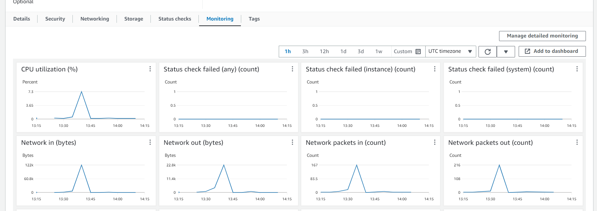
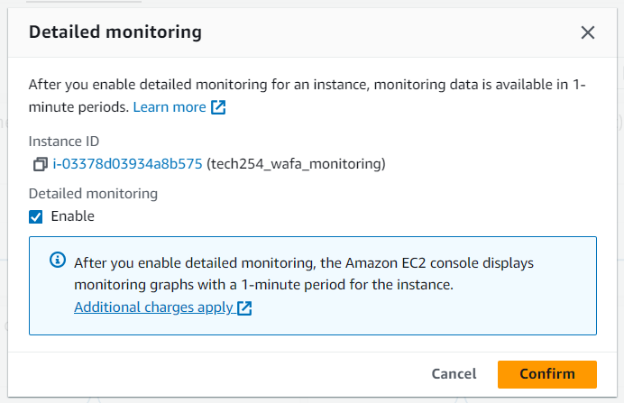
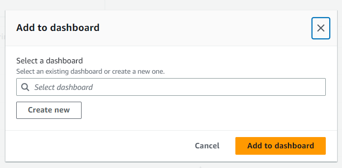

## How to create a Dashboard

1. Create an instance as usual:
   2.  Use the AMI you created
      3. Under **Advanced details**, copy and paste the following in the **User Data** section
```
#!/bin/bash

cd /home/ubuntu/repo/app
sudo systemctl restart nginx
npm install
pm2 start app.js
```

2. Launch Instance. Connect to Gitbash terminal.
3. Go onto Instance page.
4. Scroll down to the tabs as shown below and click on **Monitoring** tab

5. Click **Manage Detailed Monitoring** in the top right
6. Tick the **Enable** box as shown below and press confirm

7. It will take you back to the page with graphs. Click **Add Dashboard** in the dop right. Small pop up should appear as shown below

NOTE: If this does not appear, exit tab and re-click **Add dashboard** until it appears
8. Click **Create new**
9. Name it appropriately. In this case "tech254-wafa-first dashboard"
10. Click **create** and **Add to dashboard**
11. It will take you back to image on bullet point 7 with your newly made dashboard
12. Click **Add to dashboard**
13. Go back to instance page and to **Monitoring tab**.
14. The timescales can be changes across the top. Each individual graph can also be refreshed with real time performance
