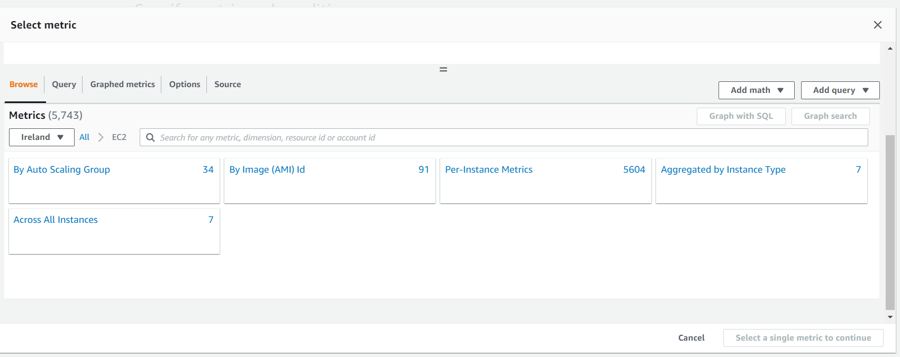
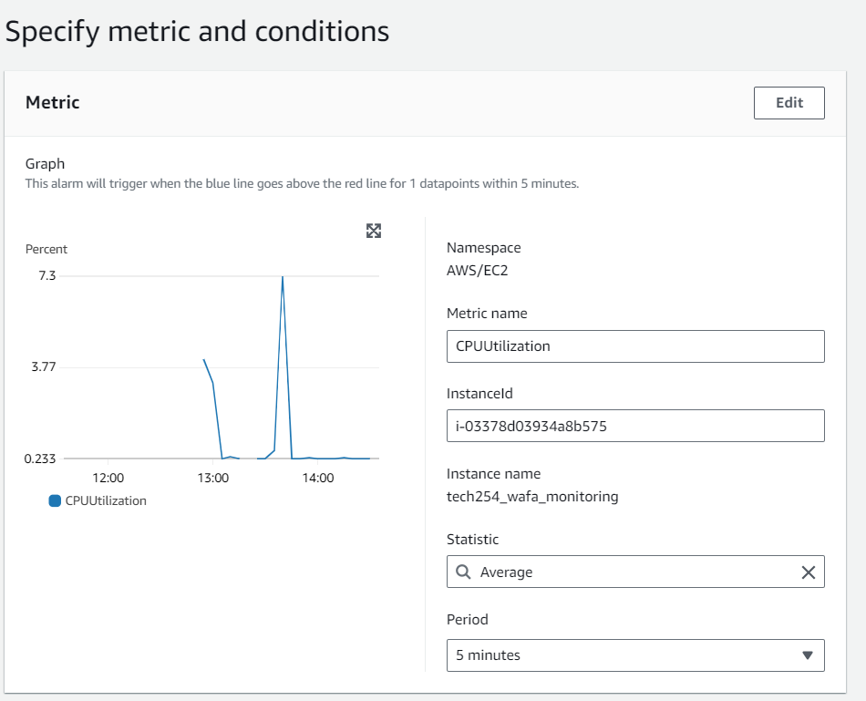
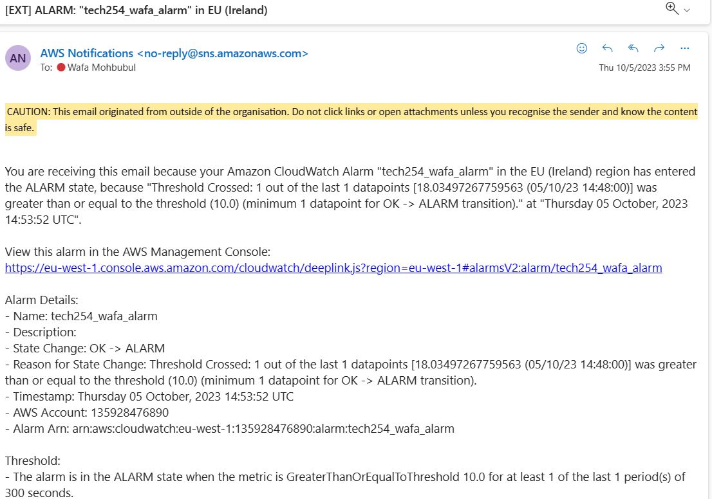

## Setting CPU Alarm

1. In navigation plane, under **Alarm**, click **All Alarms**
2. Click **Create Alarm**
3. Choose **Select Metric**
NOTE: Make sure it is set to **Ireland** as shown below

4. Select **EC2**
5. Then select **Per Instance Metric**
6. Copy and paste Instance ID in search Bar, in this instance ` i-03378d03934a8b575`. Tick the box with **CPUUtilization** as Metric Name
7. Click **Select Metric**
8. Settings should be setup as below

9. Scroll down to **Conditions**. Set conditions.

10. Press Next until successfully created.

### Triggering alarm
11. In EC2 terminal, run as mnay commands as possible to trigger the alarm. You should get an email once triggered as shown below. 
